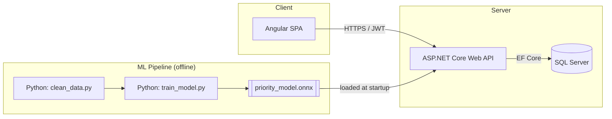
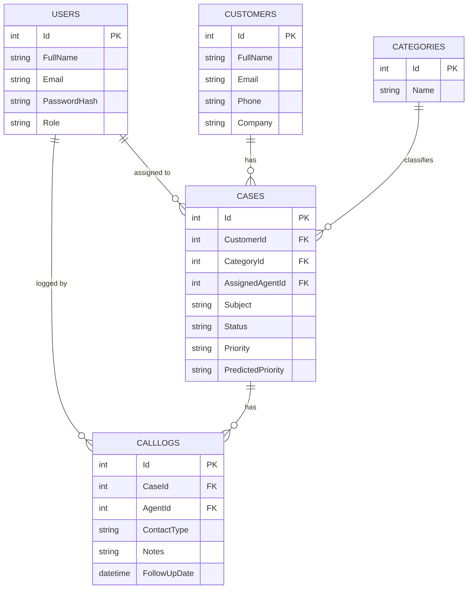

# Customer Service AI Dashboard

A web application for managing customer service cases — customer records, call/follow-up tracking, complaint categorization, and a dashboard — with a simple AI model that suggests case priority (Low / Medium / High) as soon as a case is created.

Built as a full-stack demo combining web development, database design, data cleaning, and a lightweight machine-learning pipeline.

---

## Table of Contents

- [Overview](#overview)
- [Features](#features)
- [Tech Stack](#tech-stack)
- [System Architecture](#system-architecture)
- [Database Schema](#database-schema)
- [Screenshots](#screenshots)
- [Project Structure](#project-structure)
- [Getting Started](#getting-started)
- [API Overview](#api-overview)
- [AI / ML Model](#ai--ml-model)
- [Testing](#testing)
- [Roadmap](#roadmap)
- [License](#license)

---

## Overview

Support teams typically juggle a customer list, a case/ticket log, call and follow-up notes, and some kind of reporting (often in Excel or a CRM export). This app brings those pieces together in one place and adds a small AI layer: when a new case is created, the system suggests a priority level based on the case category, the customer's history, and keywords in the complaint — which the agent can accept or override.

---

## Features

- 🔐 Login (JWT-based authentication, Admin/Agent roles)
- 👥 Customer list with create/edit/search
- 📞 Call and follow-up records attached to each case
- 🏷️ Complaint/concern categorization (Billing, Technical, Shipping/Supply Chain, Product Quality, General Inquiry)
- 📊 Dashboard: total, pending, and resolved case counts
- 🔍 Search and filter across customers and cases (status, priority, category, date range)
- 🧹 Data cleaning script for raw CSV exports (e.g. from a CRM/Excel)
- 🤖 AI/ML model predicting case priority (Low / Medium / High)
- 📈 Weekly/monthly trend charts and category breakdown charts

---

## Tech Stack

| Layer | Technology |
|---|---|
| Frontend | Angular, TypeScript, HTML/CSS, Angular Material, Chart.js |
| Backend | C# / ASP.NET Core Web API |
| Database | MS SQL Server (Entity Framework Core) |
| Data cleaning & ML | Python (pandas, scikit-learn), exported model run inside the backend |
| Auth | JWT |

---

## System Architecture



The Angular frontend only talks to the ASP.NET Core API. The API is the only component that talks to SQL Server and to the trained ML model. The model itself is trained offline by the Python scripts and loaded by the API at startup — there's no live training in the request path.

---

## Database Schema



Full DDL is in [`database/schema.sql`](database/schema.sql).

---

## Screenshots

> Add screenshots once the app is running locally and save them to `docs/screenshots/`.

| Login | Dashboard |
|---|---|
|  |  |

| Case List | Case Detail |
|---|---|
|  |  |

---

## Project Structure

```
customer-service-ai-dashboard/
├── backend/                     # ASP.NET Core Web API
│   ├── src/
│   │   ├── Controllers/
│   │   ├── Services/
│   │   ├── Repositories/
│   │   ├── Models/               # EF Core entities
│   │   ├── DTOs/
│   │   ├── Data/                 # DbContext, migrations
│   │   └── ML/                   # model loader + prediction service
│   └── tests/
├── frontend/                     # Angular app
│   └── src/app/
│       ├── auth/
│       ├── customers/
│       ├── cases/
│       ├── dashboard/
│       └── shared/
├── ml/                            # Python data cleaning + model training
│   ├── clean_data.py
│   ├── train_model.py
│   ├── requirements.txt
│   └── data/ (raw/, cleaned/)
├── database/
│   └── schema.sql
├── docs/
│   ├── CODE_DOCUMENTATION.md
│   ├── MODEL_CARD.md
│   └── screenshots/
├── README.md
└── .gitignore
```

---

## Getting Started

### Prerequisites

- [.NET 8 SDK](https://dotnet.microsoft.com/download)
- [Node.js](https://nodejs.org/) (LTS) + Angular CLI (`npm install -g @angular/cli`)
- [SQL Server](https://www.microsoft.com/sql-server) (or SQL Server Express / LocalDB)
- [Python 3.10+](https://www.python.org/) with `pip`

### 1. Database

```bash
# Run the schema against your SQL Server instance
sqlcmd -S <server> -d CustomerServiceAI -i database/schema.sql
```

### 2. Backend

```bash
cd backend/src
dotnet restore
# Set your connection string in appsettings.Development.json
dotnet ef database update
dotnet run
```
The API will start on `https://localhost:5001` (Swagger UI at `/swagger`).

### 3. Frontend

```bash
cd frontend
npm install
ng serve
```
The app will be available at `http://localhost:4200`.

### 4. ML Pipeline (one-time / periodic)

```bash
cd ml
python -m venv venv
source venv/bin/activate      # or venv\Scripts\activate on Windows
pip install -r requirements.txt

python clean_data.py          # cleans ml/data/raw/*.csv -> ml/data/cleaned/
python train_model.py         # trains and exports priority_model.onnx
```
Copy the resulting `priority_model.onnx` into `backend/src/ML/` before running the backend.

### Environment Variables

| Variable | Location | Description |
|---|---|---|
| `ConnectionStrings:DefaultConnection` | `backend/src/appsettings.Development.json` | SQL Server connection string |
| `Jwt:Secret` | `backend/src/appsettings.Development.json` | Secret key for signing JWTs |
| `apiUrl` | `frontend/src/environments/environment.ts` | Base URL of the backend API |

---

## API Overview

Full interactive documentation is available via Swagger once the backend is running (`/swagger`). Key endpoints:

| Method | Endpoint | Description |
|---|---|---|
| POST | `/api/auth/login` | Authenticate and receive a JWT |
| GET/POST/PUT/DELETE | `/api/customers` | Customer CRUD + search |
| GET/POST/PUT | `/api/cases` | Case CRUD + filtering |
| PATCH | `/api/cases/{id}/status` | Update case status |
| GET/POST | `/api/cases/{id}/calllogs` | Call/follow-up logs |
| GET | `/api/dashboard/summary` | KPI totals |
| GET | `/api/dashboard/trends` | Weekly/monthly trend data |
| POST | `/api/ml/predict-priority` | AI priority suggestion |

---

## AI / ML Model

The priority-prediction model is a multiclass classifier (Decision Tree / Random Forest) predicting **Low / Medium / High** priority from:

- Complaint category
- Number of prior cases from the same customer
- Days since the customer's last contact
- Contact channel (call / email / chat / in-person)
- Keyword flags in the complaint text (e.g. "urgent", "broken", "refund")

**Important:** for this MVP, the model is trained on a **synthetic, rule-generated dataset** (no real historical case data was available). Its predictions are a starting suggestion for the agent, not a final decision — agents can always override the suggested priority. See [`docs/MODEL_CARD.md`](docs/MODEL_CARD.md) for training details, accuracy, and instructions on retraining with real data.

---

## Testing

- Backend: `dotnet test` (xUnit tests for services and the priority-prediction path)
- Frontend: `ng test` (Jasmine/Karma tests for guards, services, and dashboard components)

---

## Roadmap

- [ ] Sentiment analysis on complaint text instead of keyword flags
- [ ] Email/SMS notifications for overdue follow-ups
- [ ] Role-based dashboard views
- [ ] Docker Compose for one-command local setup
- [ ] CI/CD pipeline for automated testing
- [ ] Retrain the model on real historical case data

---

## License

This is a personal portfolio project. Feel free to use it as a learning reference.

## Author

*(add your name, LinkedIn/GitHub, and a short line about your customer-service background here)*
