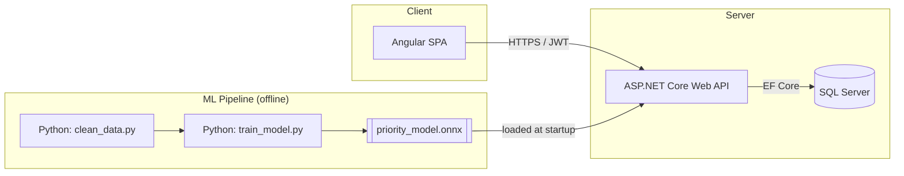
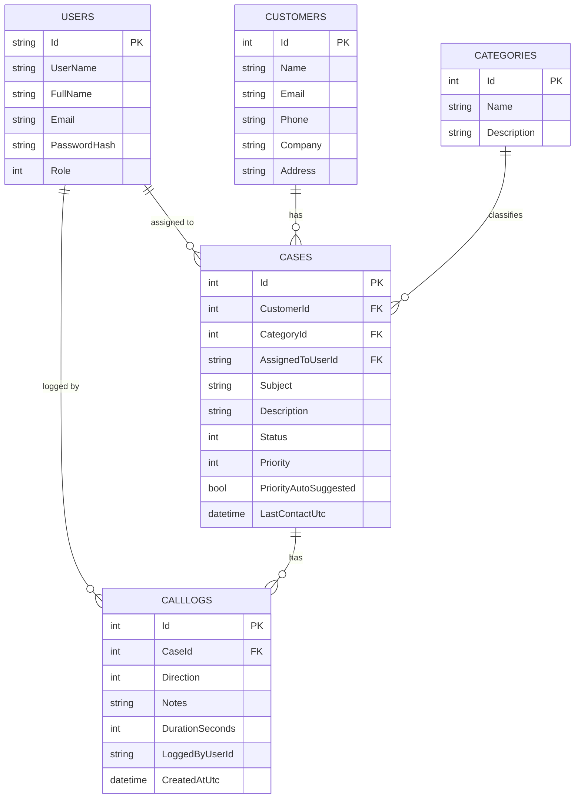
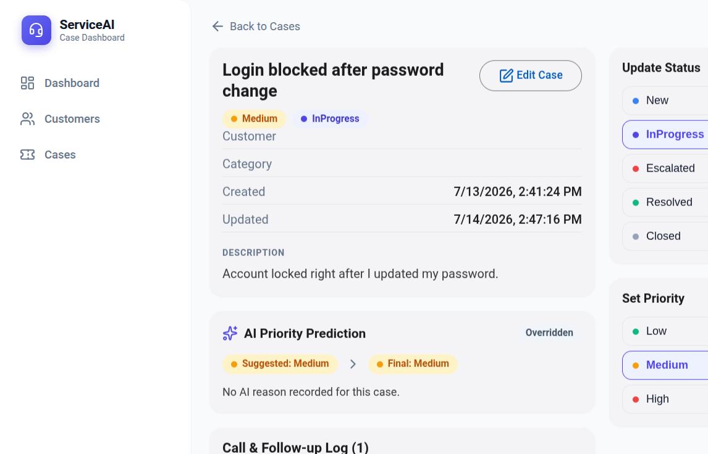
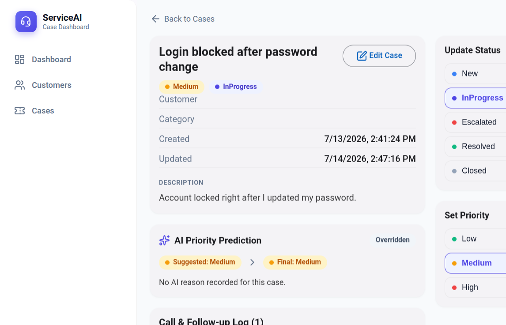
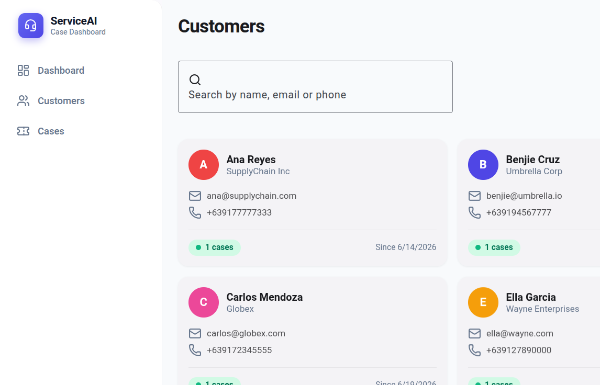
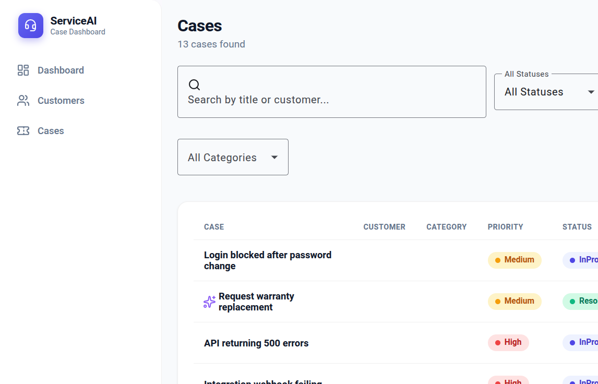

# Customer Service AI Dashboard

A web application for managing customer service cases — customer records, call/follow-up tracking, complaint categorization, and a dashboard — with a simple AI model that suggests case priority (Low / Medium / High) as soon as a case is created.

Built as a full-stack demo combining web development, database design, data cleaning, and a lightweight machine-learning pipeline.

---

## Table of Contents

- [Customer Service AI Dashboard](#customer-service-ai-dashboard)
  - [Table of Contents](#table-of-contents)
  - [Overview](#overview)
  - [Features](#features)
  - [Tech Stack](#tech-stack)
  - [System Architecture](#system-architecture)
  - [Database Schema](#database-schema)
  - [Screenshots](#screenshots)
  - [Project Structure](#project-structure)
  - [Getting Started](#getting-started)
    - [Prerequisites](#prerequisites)
    - [1. Backend (API on `http://localhost:5274`)](#1-backend-api-on-httplocalhost5274)
    - [2. Frontend (on `http://localhost:4200`)](#2-frontend-on-httplocalhost4200)
    - [3. ML Pipeline (one-time / periodic)](#3-ml-pipeline-one-time--periodic)
    - [4. Docker (one-command stack)](#4-docker-one-command-stack)
    - [Configuration](#configuration)
  - [API Overview](#api-overview)
  - [AI / ML Model](#ai--ml-model)
  - [Testing](#testing)
  - [Roadmap](#roadmap)
  - [License](#license)
  - [Author](#author)

---

## Overview

Support teams typically juggle a customer list, a case/ticket log, call and follow-up notes, and some kind of reporting (often in Excel or a CRM export). This app brings those pieces together in one place and adds a small AI layer: when a new case is created, the system suggests a priority level based on the case category, the customer's history, and keywords in the complaint — which the agent can accept or override.

---

## Features

- 🔐 Login (JWT-based authentication, Admin/Agent roles)
- 👥 Customer list with create/edit/search
- 📞 Call and follow-up records attached to each case
- 🏷️ Complaint/concern categorization (Billing, Technical, Shipping/Supply Chain, Product Quality, General Inquiry)
- 📊 Dashboard: total, pending, and resolved case counts
- 🔍 Search and filter across customers and cases (status, priority, category, date range)
- 🧹 Data cleaning script for raw CSV exports (e.g. from a CRM/Excel)
- 🤖 AI/ML model predicting case priority (Low / Medium / High)
- 📈 Weekly/monthly trend charts and category breakdown charts

---

## Tech Stack

| Layer | Technology |
|---|---|
| Frontend | Angular, TypeScript, HTML/CSS, Angular Material, Chart.js |
| Backend | C# / ASP.NET Core Web API |
| Database | MS SQL Server (Entity Framework Core) |
| Data cleaning & ML | Python (pandas, scikit-learn), exported model run inside the backend |
| Auth | JWT |

---

## System Architecture



The Angular frontend only talks to the ASP.NET Core API. The API is the only component that talks to SQL Server and to the trained ML model. The model itself is trained offline by the Python scripts and loaded by the API at startup — there's no live training in the request path.

---

## Database Schema



Full DDL is in [`database/schema.sql`](database/schema.sql).

---

## Screenshots

| Login | Dashboard |
| --- | --- |
|  |  |

| Customers | Cases | Case Detail |
| --- | --- | --- |
|  |  |  |

---

## Project Structure

```
customer-service-ai-dashboard/
├── backend/                     # ASP.NET Core 8 Web API (layered solution)
│   ├── CustomerServiceApi.sln
│   ├── src/
│   │   ├── CustomerService.Api/          # Controllers + Program.cs (composition root)
│   │   ├── CustomerService.Application/  # Services, Interfaces, DTOs
│   │   ├── CustomerService.Domain/       # EF Core entities, enums, ML contract
│   │   ├── CustomerService.Infrastructure/# AppDbContext, Repositories, Seed
│   │   └── CustomerService.ML/           # OnnxPriorityPredictor + rule fallback
│   └── tests/CustomerService.Tests/      # xUnit (placeholder)
├── frontend/                     # Angular 18 standalone SPA
│   └── src/app/
│       ├── auth/                 # login, auth.service, auth.guard, token.interceptor
│       ├── customers/            # list / detail / form + service
│       ├── cases/                # list / detail / form + service, call-log.service
│       ├── dashboard/            # KPI cards + charts
│       └── shared/               # layout, cs-icon, categories, models, reveal.directive
├── ml/                            # Python data cleaning + model training
│   ├── clean_data.py
│   ├── train_model.py
│   ├── requirements.txt
│   ├── data/                      # raw_cases.csv, cleaned/
│   └── models/priority_model.onnx  # generated, gitignored
├── database/
│   ├── install_sqlserver.sh
│   ├── schema.sql
│   └── sqlserver-data/
├── docs/
│   ├── CODE_DOCUMENTATION.md
│   ├── MODEL_CARD.md
│   └── PROGRESS_LOG.md
├── README.md
└── .gitignore
```

---

## Getting Started

### Prerequisites

- [.NET 8 SDK](https://dotnet.microsoft.com/download)
- [Node.js](https://nodejs.org/) (LTS) — Angular CLI is a local dev dependency, no global install needed
- [SQL Server](https://www.microsoft.com/sql-server) (optional — a **SQLite fallback** runs with zero setup)
- [Python 3.10+](https://www.python.org/) with `venv` (system pip is often externally-managed; use the venv)

### 1. Backend (API on `http://localhost:5274`)

The app uses EF Core `EnsureCreated()` + an idempotent seed (no migrations). It defaults to
SQL Server, but you can run it with **no database install** using the SQLite fallback:

```bash
cd backend
DOTNET_ENVIRONMENT=Development Database__Provider=Sqlite \
  dotnet run --project src/CustomerService.Api/CustomerService.Api.csproj --urls "http://localhost:5274"
```

To use SQL Server instead, set `Database:Provider` to `SqlServer` (or leave the default) and
point `ConnectionStrings:SqlServer` in `appsettings.json` at your instance, then run the same
`dotnet run` command. Swagger UI is available at `/swagger` in the Development environment only.

### 2. Frontend (on `http://localhost:4200`)

```bash
cd frontend
npm install      # already done in this workspace
npm start        # ng serve; proxies /api -> http://localhost:5274
```

Sign in with demo user `admin` / `Passw0rd!` (also `agent` / `maria`, same password).

### 3. ML Pipeline (one-time / periodic)

```bash
cd ml
python3 -m venv .venv
source .venv/bin/activate      # or venv\Scripts\activate on Windows
pip install -r requirements.txt

python clean_data.py          # cleans ml/data/raw_cases.csv -> ml/data/cleaned/
python train_model.py         # trains and exports ml/models/priority_model.onnx
```

`priority_model.onnx` is gitignored — it is loaded automatically from `ml/models/` at backend
startup (config `ML:ModelPath`). If it is absent, priority prediction falls back to rules.

### 4. Docker (one-command stack)

A `docker-compose.yml` at the repo root spins up SQL Server + the API + the Angular frontend
(Nginx) together:

```bash
docker compose up --build
# Frontend + API: http://localhost:8080  (Nginx proxies /api -> backend)
# Swagger:            http://localhost:8080/swagger
```

The API uses SQL Server inside the compose network by default. To run the API with the SQLite
fallback instead, set `Database__Provider=Sqlite` in `docker-compose.yml` and remove the `db`
service. The trained ONNX model is baked into the backend image at build time, so AI prediction
works in-container.

### Configuration

| Key | Location | Description |
|---|---|---|
| `Database:Provider` | `appsettings.json` / env `Database__Provider` | `SqlServer` (default) or `Sqlite` |
| `ConnectionStrings:SqlServer` | `appsettings.json` | SQL Server connection string |
| `ConnectionStrings:Sqlite` | `appsettings.json` | SQLite connection string (`customer_service.db`) |
| `Jwt:Key` | `appsettings.json` | Dev placeholder signing key (externalize for prod) |
| `ML:ModelPath` | `appsettings.json` | Path to `priority_model.onnx` |

---

## API Overview

Full interactive documentation is available via Swagger once the backend is running (`/swagger`). Key endpoints:

| Method | Endpoint | Description |
|---|---|---|
| POST | `/api/auth/login` | Authenticate and receive a JWT (anonymous) |
| GET / POST / PUT / DELETE | `/api/customers` | Customer CRUD |
| GET | `/api/customers/search?term=` | Search customers by name/email/phone |
| GET / POST / PUT / DELETE | `/api/cases` | Case CRUD + filters (`status`, `priority`, `categoryId`, `from`, `to`) |
| GET / POST | `/api/calllogs/case/{caseId}` | Call/follow-up logs for a case |
| GET | `/api/dashboard` | KPI totals + 30-day trend + category breakdown |

> Full interactive docs: Swagger at `http://localhost:5274/swagger` (Development only).
> There is **no** `/api/categories` endpoint — categories are a frontend constant.
| POST | `/api/ml/predict-priority` | AI priority suggestion |

---

## AI / ML Model

The priority-prediction model is a multiclass classifier (Decision Tree / Random Forest) predicting **Low / Medium / High** priority from:

- Complaint category
- Number of prior cases from the same customer
- Days since the customer's last contact
- Contact channel (call / email / chat / in-person)
- Keyword flags in the complaint text (e.g. "urgent", "broken", "refund")

**Important:** for this MVP, the model is trained on a **synthetic, rule-generated dataset** (no real historical case data was available). Its predictions are a starting suggestion for the agent, not a final decision — agents can always override the suggested priority. See [`docs/MODEL_CARD.md`](docs/MODEL_CARD.md) for training details, accuracy, and instructions on retraining with real data.

---

## Testing

- Backend: `dotnet test` (xUnit tests for services and the priority-prediction path)
- Frontend: `ng test` (Jasmine/Karma tests for guards, services, and dashboard components)

---

## Roadmap

- [x] Sentiment analysis on complaint text instead of keyword flags
- [x] Overdue follow-up detection surfaced on the dashboard (open cases past their `FollowUpDueUtc` with no follow-up since the deadline, **plus** stale open cases with no follow-up for 3+ days). Follow-up deadlines are auto-scheduled from an SLA on case creation. Email/SMS *sending* is a follow-up item below.
- [x] In-app notification center for overdue follow-ups (bell + unread badge + dropdown, persisted `Notification` records, pluggable `INotificationSender` for future Email/SMS).
- [x] Email/SMS notification *sending* for overdue follow-ups (detection + dashboard surfacing + in-app records were already done; the `INotificationSender` seam now routes to demo Email/SMS senders that log + write an outbox file — enable via `Notifications:Channels` in appsettings)
- [x] Role-based dashboard views
- [x] Docker Compose for one-command local setup
- [x] CI/CD pipeline for automated testing
- [ ] Retrain the model on real historical case data

---

## License

This is a personal portfolio project. Feel free to use it as a learning reference.

## Author

*(Glen Papillera, [LinkedIn](linkedin.com/in/gpapillera), Customer Service professional with nearly three years of experience in voice support, CRM systems, and problem-solving, now bringing a user-first mindset to software development.)*
