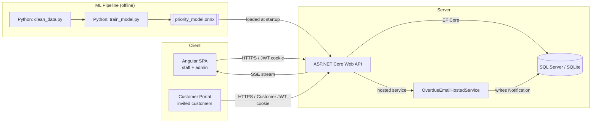
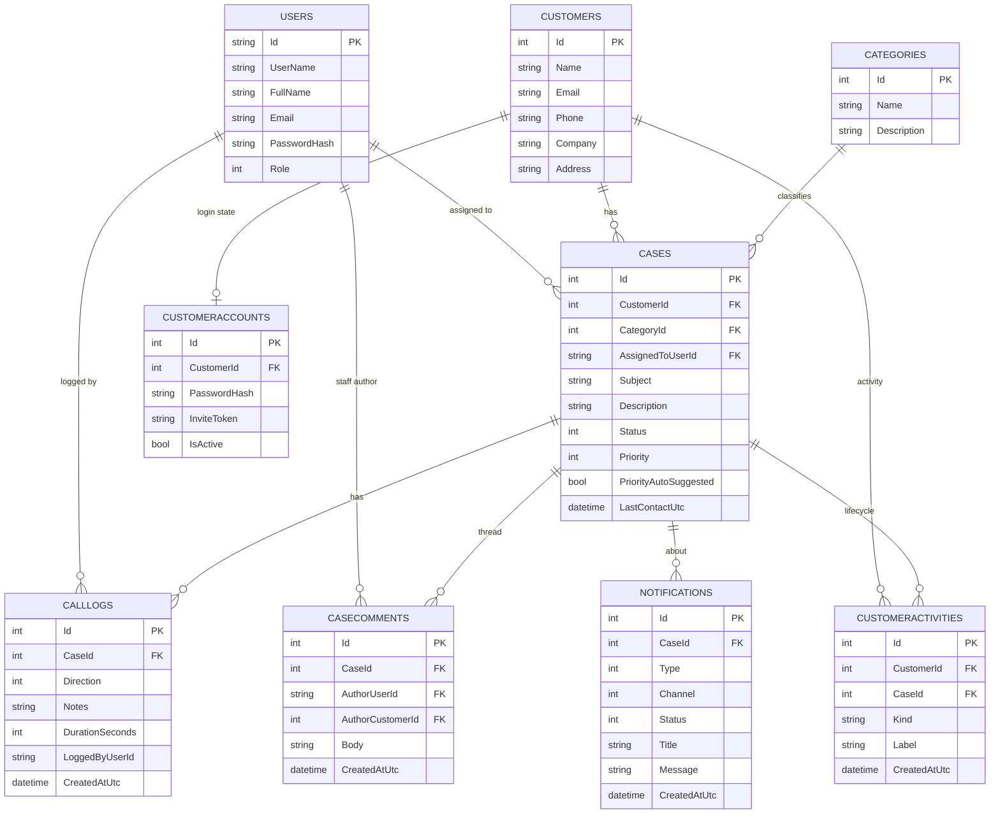
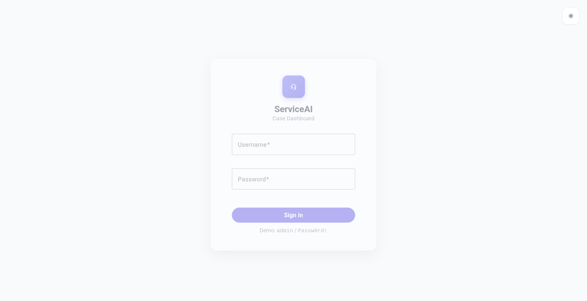
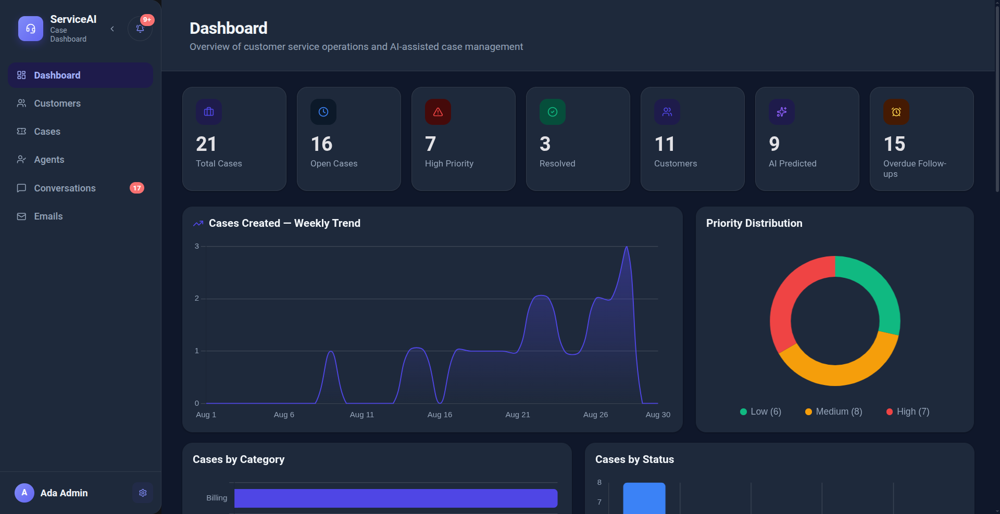
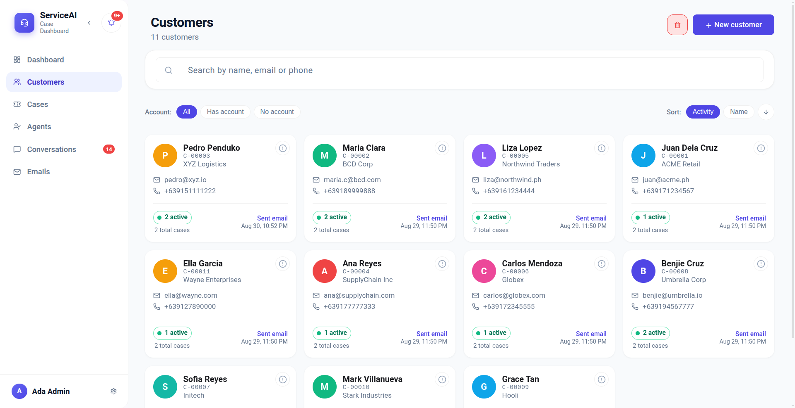
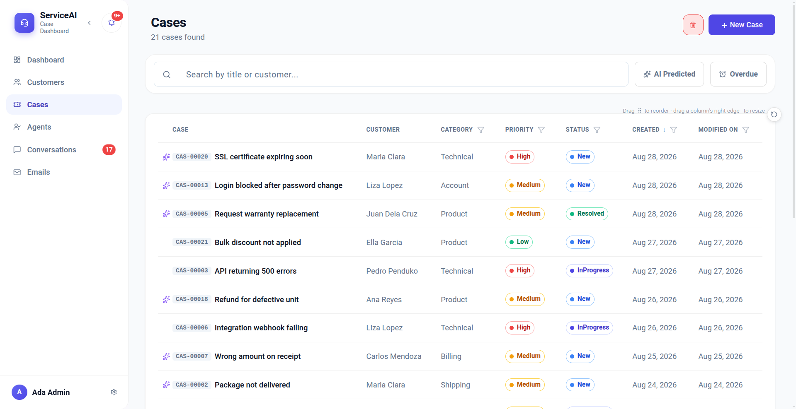
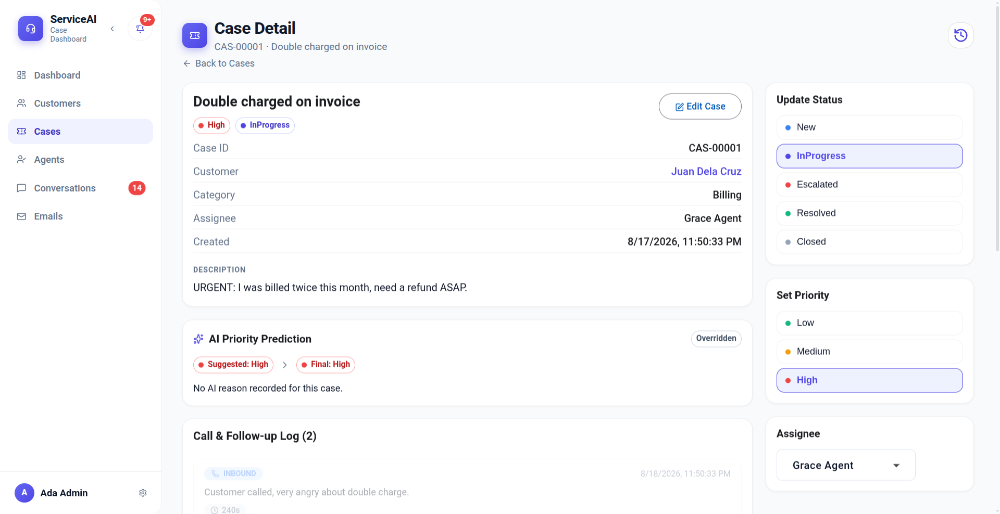

# Customer Service AI Dashboard

A full-stack customer-service platform — customer records, case/ticket management, a shared
agent↔customer comment thread, call/follow-up logging, an in-app notification center, an overdue
follow-up engine, and a dashboard — with a lightweight ML layer that suggests a case priority
(Low / Medium / High) the moment a case is created. A **customer portal** lets end customers log
in (by invite) to view and comment on their own cases.

Built as a portfolio/demo project that exercises web development, database design, data cleaning,
and a small machine-learning pipeline end to end.

---

## Table of Contents

- [Customer Service AI Dashboard](#customer-service-ai-dashboard)
  - [Table of Contents](#table-of-contents)
  - [Overview](#overview)
  - [Features](#features)
  - [Tech Stack](#tech-stack)
  - [System Architecture](#system-architecture)
  - [Database Schema](#database-schema)
  - [Screenshots](#screenshots)
  - [Project Structure](#project-structure)
  - [Getting Started](#getting-started)
    - [Prerequisites](#prerequisites)
    - [1. Backend (API on `http://localhost:5274`)](#1-backend-api-on-httplocalhost5274)
    - [2. Frontend (on `http://localhost:4200`)](#2-frontend-on-httplocalhost4200)
    - [3. ML Pipeline (one-time / periodic)](#3-ml-pipeline-one-time--periodic)
    - [Configuration](#configuration)
  - [API Overview](#api-overview)
  - [AI / ML Model](#ai--ml-model)
  - [Realtime & Notifications](#realtime--notifications)
  - [Customer Portal](#customer-portal)
  - [Testing](#testing)
  - [Roadmap](#roadmap)
  - [License](#license)
  - [Author](#author)

---

## Overview

Support teams juggle a customer list, a case/ticket log, call and follow-up notes, and some kind
of reporting (often in Excel or a CRM export). This app brings those pieces together in one place
and adds a small AI layer: when a new case is created, the system suggests a priority level from
the case category, the customer's history, and the sentiment of the description — which the agent
can accept or override.

On top of that core loop, the app adds:

- A **shared comment thread per case** visible to both staff (agent/admin) and the customer
  (through the portal), so conversations don't live in two places.
- A **recycle bin / soft-delete** model for customers and cases with restore and permanent purge
  (GDPR-style erasure), plus an **activity log** recording profile edits, deletes, and restores.
- An **overdue follow-up engine** that auto-schedules follow-up deadlines from a priority-based SLA,
  detects overdue/stale open cases, and raises **in-app notifications** (with a real Email sender
  — Gmail SMTP via MailKit — behind the `INotificationSender` seam).
- A **server-sent-events (SSE) realtime feed** so the dashboard and notification badge update
  without polling.
- A **customer-facing portal** where invited customers log in and see only their own cases.

---

## Features

Staff (Admin / Agent):

- 🔐 JWT authentication with **HttpOnly cookie** access + refresh tokens (refresh rotates on use;
  replay is revoked). Roles: `Admin`, `Agent`.
- 👥 Customer list with create / edit / search, plus a **recycle bin** (soft-delete, restore, purge).
- 🏷️ Case categorization from a fixed category set (Billing, Technical, Shipping/Supply Chain,
  Product Quality, General Inquiry) — a **frontend constant**, kept in sync with seed data.
- 📝 Cases with status + priority, **ML-suggested priority** (with a human-readable reason), and a
  shared **comment thread** between staff and customer.
- 📞 Call / follow-up logs attached to each case.
- ⏰ **Overdue follow-up detection** on the dashboard (open cases past their SLA deadline, plus
  stale open cases with no follow-up for 3+ days), driven by a priority-based SLA.
- 🔔 **In-app notification center** (bell + unread badge + dropdown), persisted `Notification`
  records; pluggable `INotificationSender` seam with a real Email (Gmail SMTP) sender.
- 📊 Dashboard: KPI totals, role-based views, 30-day trend + category-breakdown charts.
- 🔎 Search/filter across customers and cases (status, priority, category, date range).
- 🤖 AI/ML priority prediction (Low / Medium / High).
- 📈 Weekly/monthly trend + category charts (Chart.js via ng2-charts).
- 🧑‍💼 Agent management (Admin) — list staff users.
- ✉️ Email log + ad-hoc compose (Admin), Email config (Admin).
- 🧹 Data-cleaning script for raw CSV exports (CRM/Excel).
- 🟢 **Realtime SSE** feed for cases/events (dashboard + notifications update live).

Customer (invite-only portal):

- 🔑 Invite → accept → set password login (distinct `Customer` role JWT).
- 🗂️ View their own cases and post comments on the shared thread.
- 🔁 Reset password (token-based).

---

## Tech Stack

| Layer | Technology |
|---|---|
| Frontend | Angular 18 (standalone components, no NgModules), TypeScript, Angular Material, ng2-charts (Chart.js), lucide-angular icons |
| Backend | C# / ASP.NET Core 8 Web API (layered: Api / Application / Domain / Infrastructure / ML) |
| Database | SQL Server (EF Core) with a zero-setup **SQLite fallback** |
| Auth | JWT (HS256), delivered as `HttpOnly; SameSite=Lax` cookies; rotatable refresh tokens |
| Realtime | Server-Sent Events (`text/event-stream`) from the API, consumed by an `EventSource` over `fetch` |
| Data cleaning & ML | Python (pandas, scikit-learn) → ONNX model loaded and run inside the backend (Microsoft.ML.OnnxRuntime) |
| Notifications | In-app persisted records; real Email (Gmail SMTP, MailKit) sender behind `INotificationSender` |

---

## System Architecture


```mermaid
flowchart LR
    subgraph Client
        A[Angular SPA<br/>staff + admin]
        P[Customer Portal<br/>invited customers]
    end
    subgraph Server
        B[ASP.NET Core Web API]
        C[(SQL Server / SQLite)]
        N[OverdueEmailHostedService]
    end
    subgraph MLPipeline["ML Pipeline (offline)"]
        D[Python: clean_data.py]
        E[Python: train_model.py]
        F[[priority_model.onnx]]
    end

    A -- HTTPS / JWT cookie --> B
    P -- HTTPS / Customer JWT cookie --> B
    B -- EF Core --> C
    B -- SSE stream --> A
    B -- hosted service --> N
    N -- writes Notification --> C
    D --> E --> F
    F -- loaded at startup --> B
```

The Angular SPA (and the customer portal, same app, different routes) only talks to the ASP.NET
Core API. The API is the only component that talks to the database and the trained ML model. The
model is trained offline by the Python scripts and loaded by the API at startup — there is no live
training in the request path. Notifications are detected by a hosted service (and on case mutation)
and persisted as `Notification` rows; the demo senders write an outbox/email log rather than
delivering real mail.

---

## Database Schema


```mermaid
erDiagram
    USERS ||--o{ CASES : "assigned to"
    USERS ||--o{ CALLLOGS : "logged by"
    USERS ||--o{ CASECOMMENTS : "staff author"
    CUSTOMERS ||--o{ CASES : "has"
    CUSTOMERS ||--o| CUSTOMERACCOUNTS : "login state"
    CUSTOMERS ||--o{ CUSTOMERACTIVITIES : "activity"
    CATEGORIES ||--o{ CASES : "classifies"
    CASES ||--o{ CALLLOGS : "has"
    CASES ||--o{ CASECOMMENTS : "thread"
    CASES ||--o{ NOTIFICATIONS : "about"
    CASES ||--o{ CUSTOMERACTIVITIES : "lifecycle"

    USERS {
        string Id PK
        string UserName
        string FullName
        string Email
        string PasswordHash
        int Role
    }
    CUSTOMERS {
        int Id PK
        string Name
        string Email
        string Phone
        string Company
        string Address
    }
    CUSTOMERACCOUNTS {
        int Id PK
        int CustomerId FK
        string PasswordHash
        string InviteToken
        bool IsActive
    }
    CATEGORIES {
        int Id PK
        string Name
        string Description
    }
    CASES {
        int Id PK
        int CustomerId FK
        int CategoryId FK
        string AssignedToUserId FK
        string Subject
        string Description
        int Status
        int Priority
        bool PriorityAutoSuggested
        datetime LastContactUtc
    }
    CASECOMMENTS {
        int Id PK
        int CaseId FK
        string AuthorUserId FK
        int AuthorCustomerId FK
        string Body
        datetime CreatedAtUtc
    }
    CALLLOGS {
        int Id PK
        int CaseId FK
        int Direction
        string Notes
        int DurationSeconds
        string LoggedByUserId
        datetime CreatedAtUtc
    }
    CUSTOMERACTIVITIES {
        int Id PK
        int CustomerId FK
        int CaseId FK
        string Kind
        string Label
        datetime CreatedAtUtc
    }
    NOTIFICATIONS {
        int Id PK
        int CaseId FK
        int Type
        int Channel
        int Status
        string Title
        string Message
        datetime CreatedAtUtc
    }
```

`Status` and `Priority` are enums serialized as **strings** (never numbers) on both sides. Full DDL
is in [`database/schema.sql`](database/schema.sql). The app uses EF Core `EnsureCreated()` + an
idempotent seed (no migrations).

---

## Screenshots

| Login | Dashboard |
| --- | --- |
|  |  |

| Customers | Cases | Case Detail |
| --- | --- | --- |
|  |  |  |

---

## Project Structure

```text
customer-service-ai-dashboard/
├── backend/                     # ASP.NET Core 8 Web API (layered solution)
│   ├── CustomerServiceApi.sln
│   ├── src/
│   │   ├── CustomerService.Api/          # Controllers + Program.cs (composition root) + Json/
│   │   ├── CustomerService.Application/  # Services, Interfaces, DTOs, Options
│   │   ├── CustomerService.Domain/       # EF Core entities, enums, ML contract
│   │   ├── CustomerService.Infrastructure/# AppDbContext, Repositories, Seed
│   │   └── CustomerService.ML/           # OnnxPriorityPredictor + rule-based fallback
│   └── tests/CustomerService.Tests/      # xUnit (services, auth, soft-delete, notifications)
├── frontend/                     # Angular 18 standalone SPA
│   └── src/app/
│       ├── auth/                 # staff login, reset-password, auth.service, auth.guard, token.interceptor
│       ├── customer-auth/         # customer invite-accept + portal login
│       ├── customers/            # list / detail / form + service
│       ├── cases/                # list / detail / form + service, call-log.service, conversations
│       ├── dashboard/            # KPI cards + charts
│       ├── agents/               # agent (staff) management list
│       ├── messages/             # agent conversations view
│       ├── emails/               # email log / compose
│       ├── customer-portal/      # customer-facing cases (own only)
│       └── shared/               # layout, nav-badge, realtime.service, reveal.directive, categories, models
├── ml/                            # Python data cleaning + model training
│   ├── clean_data.py
│   ├── train_model.py
│   ├── requirements.txt
│   ├── data/                      # raw_cases.csv, cleaned/
│   └── models/priority_model.onnx  # generated, gitignored
├── database/
│   ├── install_sqlserver.sh
│   ├── schema.sql
│   └── sqlserver-data/
├── docs/
│   ├── CODE_DOCUMENTATION.md
│   ├── MODEL_CARD.md
│   └── PROGRESS_LOG.md
├── README.md
└── .gitignore
```

---

## Getting Started

### Prerequisites

- [.NET 8 SDK](https://dotnet.microsoft.com/download)
- [Node.js](https://nodejs.org/) (LTS) — Angular CLI is a local dev dependency, no global install needed
- [SQL Server](https://www.microsoft.com/sql-server) (optional — a **SQLite fallback** runs with zero setup)
- [Python 3.10+](https://www.python.org/) with `venv` (system pip is often externally-managed; use the venv)

### 1. Backend (API on `http://localhost:5274`)

Defaults to SQL Server, but you can run it with **no database install** using the SQLite fallback:

```bash
cd backend
DOTNET_ENVIRONMENT=Development Database__Provider=Sqlite \
  dotnet run --project src/CustomerService.Api/CustomerService.Api.csproj --urls "http://localhost:5274"
```

To use SQL Server instead, set `Database:Provider` to `SqlServer` (or leave the default) and point
`ConnectionStrings:SqlServer` in `appsettings.json` at your instance, then run the same `dotnet run`
command. Swagger UI is available at `/swagger` in the Development environment only.

> Dev note: the first run is slow — it loads the ONNX session and runs the idempotent seed. If
> `priority_model.onnx` is absent, prediction silently falls back to rules (see [AI / ML Model](#ai--ml-model)).

### 2. Frontend (on `http://localhost:4200`)

```bash
cd frontend
npm install      # already done in this workspace
npm start        # ng serve; proxies /api -> http://localhost:5274
```

Sign in with a demo staff user `admin` / `Passw0rd!` (also `agent` / `maria`, same password). The
SPA stores the JWT in `sessionStorage` and sends it as a Bearer header; the API also sets
`HttpOnly` cookies for refresh. There is **no** `/api/categories` endpoint — categories are a
frontend constant.

### 3. ML Pipeline (one-time / periodic)

```bash
cd ml
python3 -m venv .venv
source .venv/bin/activate      # or venv\Scripts\activate on Windows
pip install -r requirements.txt

python clean_data.py          # cleans ml/data/raw_cases.csv -> ml/data/cleaned/
python train_model.py         # trains and exports ml/models/priority_model.onnx
```

`priority_model.onnx` is gitignored — it is loaded automatically from `ml/models/` at backend
startup (config `ML:ModelPath`). If it is absent, priority prediction falls back to rules.

### Configuration

| Key | Location | Description |
|---|---|---|
| `Database:Provider` | `appsettings.json` / env `Database__Provider` | `SqlServer` (default) or `Sqlite` |
| `ConnectionStrings:SqlServer` | env `ConnectionStrings__SqlServer` (NOT committed) | SQL Server connection string — supply via env/secret; the repo value is a redacted placeholder |
| `ConnectionStrings:Sqlite` | `appsettings.json` | SQLite connection string (`customer_service.db`) |
| `Jwt:Key` | user-secrets / env `Jwt__Key` | **Required.** HS256 signing key (≥48 bytes entropy). The app **refuses to start** if missing or still the committed placeholder. Never commit a real value. |
| `Jwt:AccessTokenMinutes` | `appsettings.json` / env `Jwt__AccessTokenMinutes` | Access-token lifetime (default **15**). Delivered as an `HttpOnly` cookie so XSS can't read it. |
| `Jwt:RefreshTokenDays` | `appsettings.json` / env `Jwt__RefreshTokenDays` | Refresh-token lifetime (default **14**). Server-side, rotatable, single-use (replay is revoked). |
| `Cors:AllowedOrigins` | `appsettings.json` / env `Cors__AllowedOrigins` | Comma-separated permitted SPA origins (default `http://localhost:4200`). The CORS policy **DOES allow credentials** (required for the auth cookies). Keep to real origins only — never `*` with credentials. |
| `AllowedHosts` | `appsettings.json` / env `AllowedHosts` | Hosts the API answers for (default `localhost,127.0.0.1`). Set to `*` only for local testing. |
| `Notifications:Channels` | `appsettings.json` / env `Notifications__Channels` | Enables the Email sender (`InApp`, `Email`). Email delivers via Gmail SMTP; a `DevOverrideRecipient` redirect protects real inboxes in Development. |
| `ML:ModelPath` | `appsettings.json` | Path to `priority_model.onnx` |

> 🍪 **Cookie auth.** The JWT is delivered as two `HttpOnly; SameSite=Lax` cookies
> (`access_token`, `refresh_token`). The SPA sends them automatically via `withCredentials: true`
> and also attaches a legacy `Authorization` header when present. The refresh cookie rotates on use;
> replaying an old one returns `401`. `Secure` is set automatically when the request is HTTPS. The
> SSE realtime feed authenticates the same way (`fetch` + `credentials: 'include'`). See
> `docs/PROGRESS_LOG.md` → "Phase C+: Cookie Auth + Refresh Tokens".

> ⚠️ **Production secrets.** This repo previously shipped real-looking credentials in
> `appsettings.json` (SQL Server password) and `appsettings.Development.json` (Gmail app password).
> Both are redacted to `CHANGE-ME-USE-ENV` placeholders — supply them via env/`dotnet user-secrets`,
> never commit them. The `Jwt:Key` worst offender was removed; the API throws at startup unless a
> real key is configured. See `docs/PROGRESS_LOG.md` → "Phase C: Backend Security Hardening".

---

## API Overview

Full interactive docs via Swagger once the backend is running (`/swagger`). Key controllers:

| Controller | Route | Role | Notes |
|---|---|---|---|
| Auth | `/api/auth` | anonymous (login) | Staff login; sets auth cookies |
| Users | `/api/users` | Admin/Agent | Staff user list |
| CustomerAuth | `/api/customer-auth` | anonymous | Customer invite accept + portal login |
| CustomerPortal | `/api/customer-portal` | Customer | Own cases + comments |
| Customers | `/api/customers` | Admin/Agent | CRUD + `search?term=` |
| Cases | `/api/cases` | Admin/Agent | CRUD + filters; `events` (SSE); `my-conversations` / `all-conversations` |
| CallLogs | `/api/calllogs` | Admin/Agent | Per-case call/follow-up logs |
| Dashboard | `/api/dashboard` | Admin/Agent | KPI totals + trend + category breakdown |
| Notifications | `/api/notifications` | Admin/Agent | In-app notification center |
| Ml | `/api/ml` | Admin/Agent | `predict-priority` |
| Emails | `/api/emails` | Admin/Agent | Email log + compose/resend (compose Admin-only) |
| EmailConfig | `/api/email-config` | Admin | Email sender config |
| CaseEvents | `/api/cases/events` | Admin/Agent | SSE stream (`text/event-stream`) |

There is **no** `/api/categories` endpoint — categories are a frontend constant synced with seed data.

---

## AI / ML Model

The priority model is a multiclass classifier (**Decision Tree**, exported via `skl2onnx`) predicting
**Low / Medium / High** from exactly **4 numeric features**:

- `category_id` — the case category (1–5, aligned with seed categories)
- `prior_case_count` — number of prior cases from the same customer
- `days_since_contact` — days since the customer's last contact
- `sentiment` — a lexicon-based sentiment score in **[-1, 1]** computed from the description
  (negative = complaint/urgency, positive = satisfaction). This **replaces the old binary
  complaint-keyword flag**.

The backend consumes the same 4-float ordering via `IPriorityPredictor.Predict(PriorityFeatures)`.
When `priority_model.onnx` is present it is used (`PriorityModelSource.Onnx`); otherwise the API
falls back to `RuleBasedPriorityPredictor` (deterministic, dependency-free) and labels the
suggestion accordingly so the fallback is never silent.

**Important:** the model is trained on a **synthetic, rule-generated dataset** (no real historical
case data). Its predictions are a starting suggestion for the agent, not a final decision — agents
can always override. See [`docs/MODEL_CARD.md`](docs/MODEL_CARD.md) for training details and
retraining with real data.

---

## Realtime & Notifications

- **SSE feed** — `GET /api/cases/events` streams `CaseEvent` JSON over `text/event-stream`
  (staff-only). The browser `EventSource` can't set auth headers, so the frontend opens it via a
  streaming `fetch` that sends the staff JWT; the dashboard and notification badge update live.
- **Overdue engine** — `OverdueEmailHostedService` scans for open cases past their SLA
  `FollowUpDueUtc`, plus stale open cases with no follow-up for 3+ days, and writes `Notification`
  rows (type `CaseOverdue`). Follow-up deadlines are auto-scheduled from an SLA keyed on priority
  (High = 1 day, …) at case creation.
- **Notification center** — persisted `Notification` records (bell + unread badge + dropdown). The
  `INotificationSender` seam routes Email notifications to a real Gmail SMTP sender (MailKit) that
  delivers mail; `SmsNotificationSender` was intentionally removed — the demo ships Email-only.

---

## Customer Portal

Invited customers get their own login separated from staff:

- An admin/agent sends an invite (`CustomerAuthService.SendInviteAsync`) → 48h `InviteToken` on
  `CustomerAccount` (1:1 with `Customer`).
- The customer accepts the invite, sets a BCrypt password, and gets a `Customer`-role JWT (distinct
  from the staff `AuthService`).
- Portal routes (`/customer/...`) expose only that customer's cases and the shared comment thread.
- Password reset is token-based (48h window, single-use).

The shared `CaseComment` thread is the same data reached through two authorization-scoped endpoints:
exactly one of `AuthorUserId` (staff) / `AuthorCustomerId` (customer) is set per comment, enforced
in `CaseCommentService`.

---

## Testing

- Backend: `dotnet test CustomerServiceApi.sln` (xUnit — services, auth boundaries, soft-delete,
  notification routing, email templates; **141 tests**).
- Frontend: `npm test` (Jasmine/Karma — guards, services, dashboard, nav-badge; **47 spec cases**
  across 7 files).

### Manual QA checklist
Run the backend (`:5274`) and frontend (`:4200`) first (see [Getting Started](#getting-started)).
Demo creds: `admin` / `Passw0rd!` (also `agent` / `maria`).

- **Auth** — logged-out hits redirect to `/login`; `admin`/`Passw0rd!` lands on `/dashboard`; wrong
  password errors; Sign Out clears session.
- **Customers** — `/customers` lists seeded customers w/ case counts; search filters (debounced);
  New Customer modal adds a row; empty Name / bad Email errors; row → detail; Edit/Delete (admin) work.
- **Cases** — `/cases` lists status/priority/category pills; filters narrow; New Case **Get AI
  suggestion** previews a priority; no explicit priority stores ML value + flags AI-predicted; detail
  shows AI panel + Call Log; adding a call log appends; Edit overrides priority/status (clears AI
  flag); Delete (confirm) removes.
- **Dashboard** — KPI cards (Total/Open/High/Resolved/Customers/AI Predicted); trend line + priority
  donut + category bar + status bar (all 5 statuses even at 0); Recent Cases links.
- **API/Errors** — `POST /api/cases` missing `subject` → 400 JSON envelope (no stack trace);
  `GET /api/cases/{missing}` → 404 JSON; Swagger at `http://localhost:5274/swagger`.
- **ML** — `POST /api/ml/predict-priority` returns priority + plain-English reason; "urgent"/"refund"/
  "broken" trends higher than neutral.

---

## Docker (one-command stack)

A full local stack — SQL Server + ASP.NET Core API + Angular SPA (served by Nginx) — is defined in `docker-compose.yml` at the repo root. Run it with:

```bash
docker compose up --build
# App:      http://localhost:8080          (Nginx serves the SPA + proxies /api -> backend)
# Swagger:  http://localhost:8080/swagger  (backend runs in Development env)
```

What's in the box:
- **db** — `mcr.microsoft.com/mssql/server:2022-latest`, health-gated, with a named volume (`mssql-data`).
- **backend** — built from `backend/Dockerfile` (context = repo root so it can reach both `backend/src` and `ml/`). The ONNX priority model is **generated at build time** from `ml/train_model.py` (the model file is gitignored, so a clean clone has none). If generation ever fails, the API still falls back to the rule-based predictor.
- **frontend** — built from `frontend/Dockerfile`; Nginx serves the static bundle and proxies `/api/` (and `/swagger/`) to the backend on the internal network. The SPA calls the API via relative `/api` URLs, so no API host is baked into the image.

Notes / gotchas:
- The backend runs as `Development` in this stack so Swagger is available. For a production image, set `ASPNETCORE_ENVIRONMENT=Production` and supply a real `Jwt__Key` (the compose file ships a **dev-only** placeholder key — never use it in production).
- To use the **SQLite** fallback instead of SQL Server, set `Database__Provider=Sqlite` and remove the `db` service + its `mssql-data` volume reference.
- Prereqs: Docker Engine + Compose v2. The first build pulls the .NET SDK, Node, and Python (for the ML stage) images, so expect a slow first run.

---

## Roadmap

- [x] Sentiment scoring on complaint text (replaces keyword flags) as the ML feature
- [x] Overdue follow-up detection surfaced on the dashboard (SLA-based deadline + stale-open rule)
- [x] In-app notification center (bell + unread badge + dropdown, persisted `Notification`)
- [x] Demo Email/SMS sender seam (logs + outbox file) behind `INotificationSender`
- [x] **Real Email delivery** — `EmailNotificationSender` delivers via Gmail SMTP (MailKit); overdue/resolved/invite/reset emails send for real (SMS removed — Email-only by design)
- [x] Soft-delete / recycle bin / restore / purge (GDPR erasure) + activity log
- [x] Shared agent↔customer comment thread + customer portal (invite/accept/login)
- [x] SSE realtime feed for cases/events
- [x] Role-based dashboard views (Admin vs Agent)
- [x] Agent management + email log/compose UI
- [x] **Docker Compose** one-command stack (SQL Server + API + Angular/Nginx) — see [Docker](#docker-one-command-stack)
- [x] **CI/CD pipeline** for automated build/test (`.github/workflows/ci.yml` — 3 jobs: backend dotnet test, frontend ng test+build, Docker SQL Server e2e smoke)
- [ ] Retrain on real historical case data — **blocked: no real data exists** (see note)

> **Note on "retrain on real data":** the shipped model is trained on a synthetic,
> rule-labeled dataset (≈95% accuracy on a held-out split) generated by
> `ml/train_model.py`. `export_training_data.py` + `train_model.py --data` form a
> ready retraining path, but the only data currently in the repo is the *seeded
> demo* database (synthetic), so exporting it yields no real triage signal — an
> earlier attempt (Phase 23q) produced a 33% model that collapsed to always
> predicting "Medium", which is *worse* than the synthetic baseline and was
> rejected. Retrain here only when genuine human-triaged case exports exist.

---

## License

This is a personal portfolio project. Feel free to use it as a learning reference.

## Author

*(Glen Papillera, [LinkedIn](linkedin.com/in/gpapillera), Customer Service professional with nearly
three years of experience in voice support, CRM systems, and problem-solving, now bringing a
user-first mindset to software development.)*
